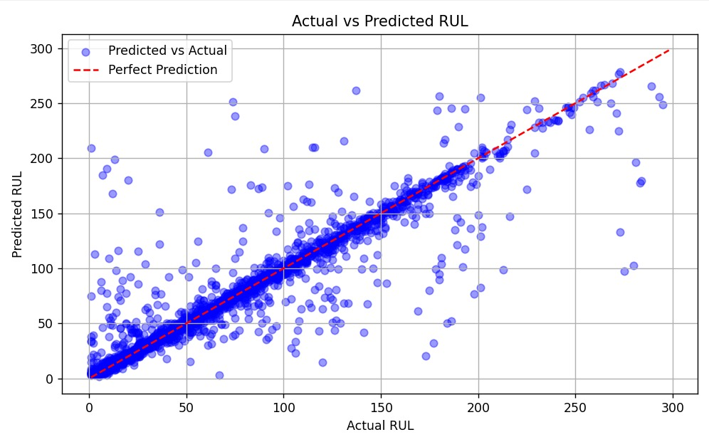

# 🛠 Predictive Maintenance - RUL Estimation with Random Forest

This project implements a *predictive maintenance model* using time-series equipment data to estimate the *Remaining Useful Life (RUL)* of devices. The model is trained using a Random Forest Regressor and includes full data preprocessing, label creation, training, evaluation, and visualization steps.

---

## 📂 Dataset Overview

The dataset contains records from various devices over time, including:
- device: Unique device ID  
- date: Timestamp of the recorded entry  
- metric*: Sensor readings/features over time  
- failure: Binary flag indicating device failure at that point  

---

## 📊 Project Workflow

### 1. *Data Preparation*
- Load CSV data
- Convert and clean date column
- Sort by device and time

### 2. *RUL Label Creation*
- For each device, calculate the RUL (Remaining Useful Life) before a failure
- Remove records without a failure (or undefined RUL)

### 3. *Feature Selection*
- Use all columns starting with metric as input features

### 4. *Model Training*
- Use RandomForestRegressor from scikit-learn
- Split dataset into training and test sets

### 5. *Model Evaluation*
- Report *Root Mean Squared Error (RMSE)* and *R² score*
- Plot predicted vs actual RUL for visual inspection

---

## 📈 Sample Output
(RMSE)* = 23.66
R² score = 0.84

### Actual vs Predicted Scatter plot

